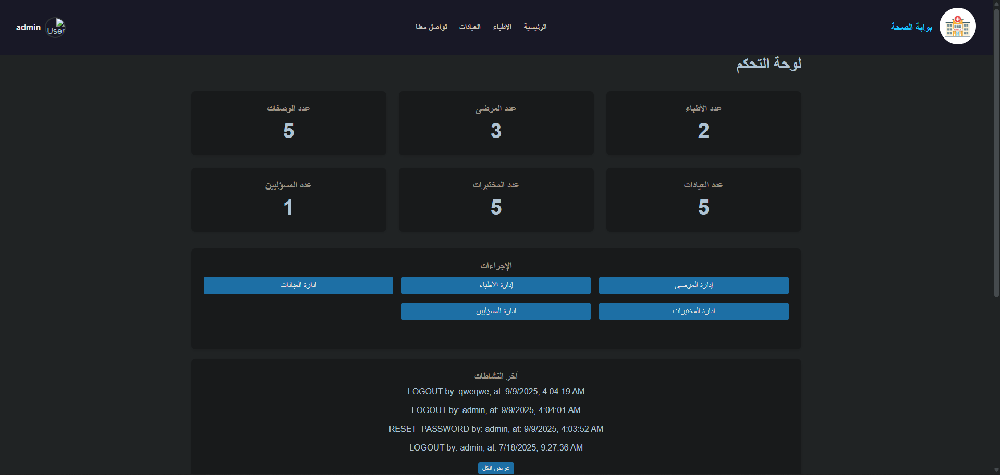
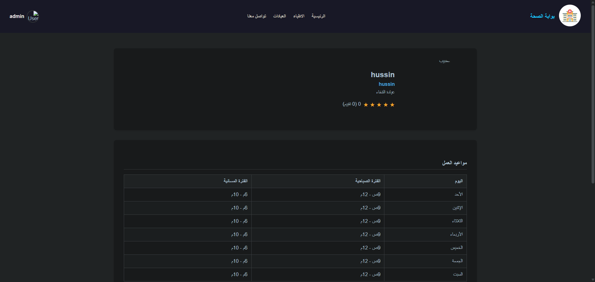
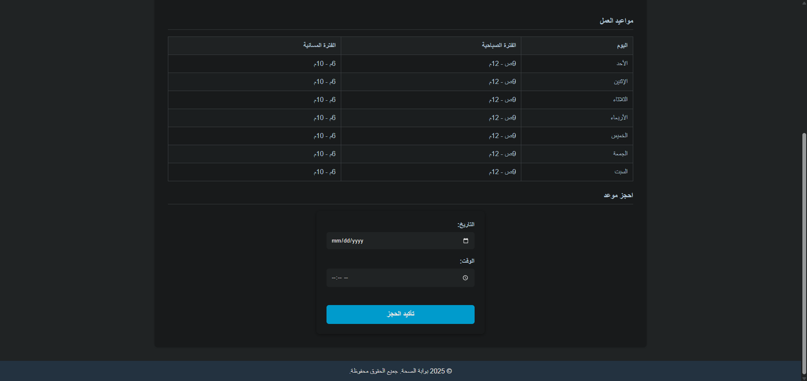
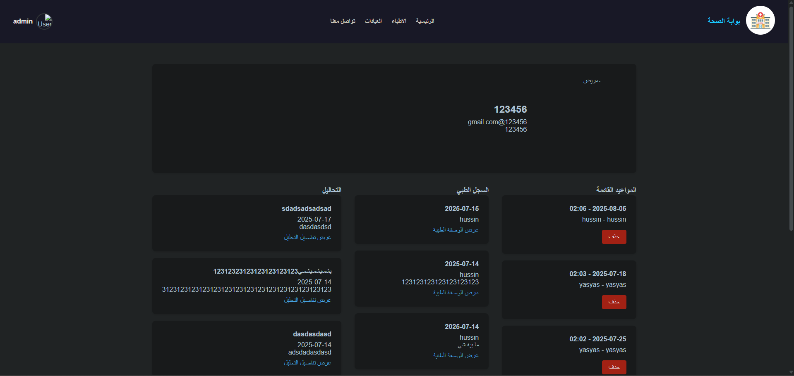

# 🏥 Medical Booking System (نظام حجوزات العيادات الطبية)

> An integrated web-based platform for managing medical clinics, appointments, patients, and laboratory results. Built with **Node.js**, **Express**, and **EJS**, designed for efficiency and ease of use.


## 📖 Table of Contents
- [Project Overview](#project-overview)
- [Key Features](#key-features)
- [Tech Stack](#tech-stack)
- [System Architecture](#system-architecture)
- [Installation Guide](#installation-guide)
- [Running the Application](#running-the-application)
- [Project Structure](#project-structure)
- [API Documentation](#api-documentation)
- [Performance & Security](#performance--security)
- [Screenshots](#screenshots)

---

## <a name="project-overview"></a>🩺 Project Overview
The **Medical Booking System** is a comprehensive solution designed to bridge the gap between patients, healthcare providers, and laboratory technicians. It offers a seamless experience for booking appointments, managing medical history, and tracking lab results securely.

The system supports four distinct user roles:
1.  **Administrator (Admin)**: Full control over the system, users, clinics, and logs.
2.  **Doctor**: Manages schedule, views patient history, and issues prescriptions.
3.  **Patient**: Books appointments, views medical records, and receives lab results.
4.  **Lab Technician**: Receives requests and uploads test results directly to patient profiles.

---

## <a name="key-features"></a>✨ Key Features

### 👨‍💼 **Admin Panel**
*   **Comprehensive Dashboard**: Real-time statistics on doctors, patients, and bookings.
*   **User Management**: create/edit/delete accounts for Doctors, Admins, and Lab Technicians.
*   **Clinic Management**: Add and manage clinic locations and details.
*   **Activity Logs**: Detailed tracking of all system actions for security auditing.
*   **Message Center**: View and manage support messages from users.

### 👨‍⚕️ **Doctor Portal**
*   **Schedule Management**: View daily appointments and manage clinic hours.
*   **Patient Records**: Access patient medical history and previous visits.
*   **E-Prescribing**: Write and issue digital prescriptions associated with specific diagnoses.
*   **Patient Search**: Quickly find patients by name or ID.

### 👤 **Patient Portal**
*   **Easy Booking**: Search for doctors by specialty or name and book appointments.
*   **Medical Profile**: View personal medical history, past appointments, and prescriptions.
*   **Lab Results**: Access laboratory test results online.
*   **Doctor Info**: View detailed doctor profiles including schedules and clinic locations.

### 🧪 **Lab Portal**
*   **Result Reporting**: Upload and send analysis results directly to patients.
*   **Integration**: Seamlessly linked with patient profiles for instant updates.

---

## <a name="tech-stack"></a>🛠 Tech Stack

### **Frontend**
*   **EJS (Embedded JavaScript)**: Server-side templating for dynamic HTML generation.
*   **CSS3 & JavaScript**: Custom styling and interactive DOM manipulation.
*   **Responsive Design**: Mobile-friendly interfaces for all user roles.

### **Backend**
*   **Node.js**: Runtime environment.
*   **Express.js**: Web framework for routing and middleware.
*   **Session Management**: `express-session` for secure stateful authentication.
*   **Encryption**: `bcrypt` for hashing user passwords.
*   **Twilio SDK**: Integrated for SMS notifications and OTP verification (configured).

### **Database & Storage**
*   **Quick.db / Better-SQLite3**: Fast, file-based database for storing JSON-like structures securely.
*   **LowSB**: Lightweight local JSON database.
*   **File System**: Used for logging and static asset serving.

### **DevOps & Tools**
*   **Nodemon**: For hot-reloading during development.
*   **Dotenv**: Environment variable management.
*   **Serve-Index**: Integrated file explorer for system assets (dev feature).

---

## <a name="system-architecture"></a>🏗 System Architecture
The application follows the **MVC (Model-View-Controller)** pattern:

*   **Views (`/views`)**: EJS templates acting as the UI layer. separated into feature-based folders (e.g., `partials`, dashboard views).
*   **Controllers (`app.js` & Routes)**: Logic handles HTTP requests, authenticates users (`middleware`), and interacts with the database.
*   **Models (Database)**: Data persistence is handled via `Quick.db` wrappers interacting with the local filesystem (`json.sqlite`).

### Security Measures
*   **Role-Based Access Control (RBAC)**: Middleware (`requireAdmin`, `requireDoctor`, etc.) ensures users can only access authorized resources.
*   **Origin Verification**: `verifyOrigin` middleware prevents unauthorized cross-site requests.
*   **Input Sanitization**: Basic checks on input fields to prevent common injection attacks.
*   **Password Hashing**: Industry-standard `bcrypt` encryption for credential storage.

---

## <a name="installation-guide"></a>📥 Installation Guide

### Prerequisites
*   Node.js (v14 or higher)
*   npm (Node Package Manager)

### Steps
1.  **Clone the Repository**
    ```bash
    git clone https://github.com/its-ali-hadi/health-portal.git
    cd health-portal
    ```

2.  **Install Dependencies**
    ```bash
    npm install
    ```

3.  **Configure Environment**
    Create a `.env` file in the root directory and add your keys (optional for basic local run):
    ```env
    TWILIO_ACCOUNT_SID=your_sid_here
    TWILIO_AUTH_TOKEN=your_token_here
    PORT=3000
    ```

4.  **Initialize Database**
    The system will automatically generate `json.sqlite` and default admin accounts on the first run.

---

## <a name="running-the-application"></a>🚀 Running the Application

### Development Mode
Runs with `nodemon` for auto-restart on changes.
```bash
npm run dev
```

### Production Mode
Standard start script.
```bash
npm start
```

*   **Main App**: Visit `http://localhost:3000`
*   **File Explorer**: Visit `http://localhost:5000` (if enabled in `app.js`)

> **Default Admin Credentials**:
> *   Username: `admin`
> *   Password: `admin123` (or check console logs during initialization)

---

## <a name="project-structure"></a>📂 Project Structure

```plaintext
medical-booking-system/
├── database/            # Database initialization scripts
├── public/              # Static files (CSS, JS, Images)
├── views/               # EJS Templates
│   ├── partials/        # Reusable components (headers, footers)
│   └── ...              # Page templates (dashboard, login, profile)
├── app.js               # Main application entry point & logic
├── .env                 # Environment variables
├── package.json         # Project dependencies
└── README.md            # Documentation
```

---

## <a name="api-documentation"></a>🔌 API Endpoints
While primarily a server-side rendered app, there are internal API endpoints for AJAX calls.

| Method | Endpoint | Description | Access |
| :--- | :--- | :--- | :--- |
| `GET` | `/api/doctors` | Search doctors by name or specialty | Admin/Public |
| `POST` | `/login` | Authenticate user session | Public |
| `POST` | `/book-appointment/:id`| Book a new appointment | Patient |
| `GET` | `/search-patients` | Search patient database | Doctor/Lab |

---

## <a name="performance--security"></a>🛡 Performance & Security Notes

*   **Scaling**: The current implementation uses a file-based database (`Quick.db`). For high-traffic production environments, it is recommended to migrate to **PostgreSQL** or **MongoDB**. The code uses an adapter pattern that makes this migration straightforward.
*   **Session Security**: Sessions are stored in-memory. For distributed scaling, consider using `connect-redis`.
*   **Data Validation**: All inputs are validated on the server side to ensure data integrity.

---

## <a name="screenshots"></a>📸 Screenshots

| **Admin Dashboard** | **Doctor Profile** |
|:---:|:---:|
|  |  |

| **Patient Booking** | **Prescription View** |
|:---:|:---:|
|  |  |

---

<center>
  <p>Developed with ❤️ by the Development Team</p>
  <p>2025 © Medical Booking System. All Rights Reserved.</p>
</center>